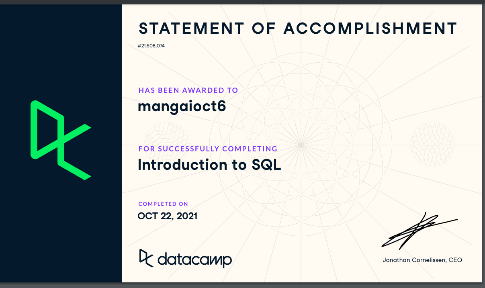

###### WHAT IS RDBMS?

**RDBMS stands for Relational Database Management System** A relational database is a database that stores data in a table form, containing columns and rows.  A database management system (DBMS) is a system software for creating and managing databases.

#### Basic Features of RDMS:
* The data in RDBMS is stored in database objects called tables. A table is a collection of related data entries and it consists of columns and rows.
* Numerous users can access it together which is managed by a single user
* Virtual tables are available for storing the insightful data
* To retrieve the information the indexes are used.

The DBMS provides users and programmers with a systematic way to create, retrieve, update and manage data. Relation in the RDMS is the deposit of tuples having the similar characteristics. A relation in RDMS means the set of the entities and data contained in them. The entities are different instances and their relation is organized in different rows and columns in the data table.  The related information is of identical domains and constraints. By deleting old data and by inserting new data, relations are altered in the database model.SQL is the language used for communicating with data in an RDBMS.

###### WHAT IS SQL?

**SQL or Structured Query Language is the standard language for dealing with Relational Databases.** It’s used to perform data interacting tasks such as creating a table and inserting data into it, querying and filtering data, modifying and updating data ,delete data or table. The select statement is used to query the database and retrieve selected data.The column names that follow the select keyword determine which columns will be returned in the results. To create a new table, enter the keywords create table followed by the table name.The insert statement is used to insert or add a row of data into the table. The update statement is used to update or change records that match a specified criteria. The delete statement is used to delete records or rows from the table. The GROUP BY clause will gather all of the rows together that contain data in the specified columns and will allow aggregate functions to be performed on the one or more columns. Aggregate Functions are
 
* MIN	returns the smallest value in a given column
* MAX	returns the largest value in a given column
* SUM	returns the sum of the numeric values in a given column
* AVG	returns the average value of a given column
* COUNT	returns the total number of values in a given column
* COUNT(*)	returns the number of rows in a table

The HAVING clause allows us to specify which rows should be selected will be based on the conditions we gave. ORDER BY is an optional clause which will display the results of our query in a sorted order(either ascending order or descending order). These are some basic keywords in SQL.

###### Screenshot of Datacamp Course 

